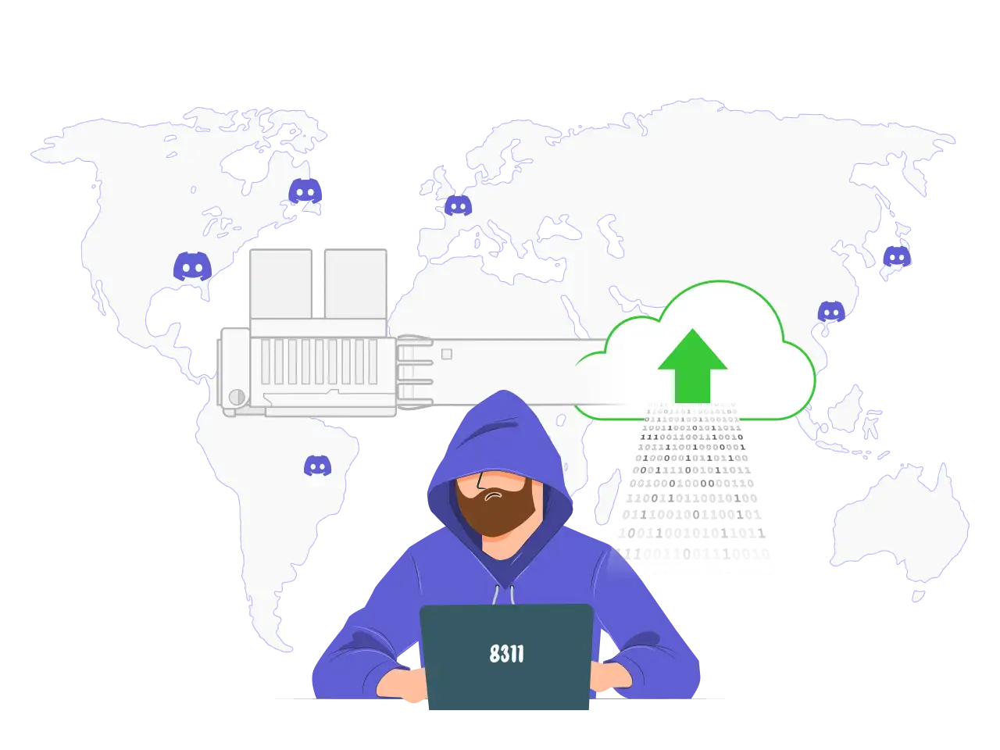
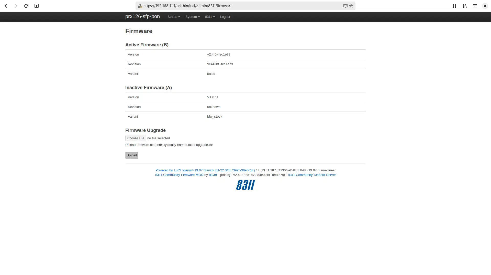

# Install 8311 community firmware on the BFW Solutions WAS-110

{ class="nolightbox" }
<!-- more -->
<!-- nocont -->

Out of the box, the [WAS-110] is not fully compatible with varying ISP OLT configurations, with issues ranging from 
vendor-specific managed entities to VEIP to IEEE standards such as [802.1X] and [802.1ad]. Due to these 
incompatibilities and discovered bugs, a community firmware[^1] has been curated to fix any impeding issues[^2]. 

  [802.1X]: https://en.wikipedia.org/wiki/IEEE_802.1X
  [802.1ad]: https://en.wikipedia.org/wiki/IEEE_802.1ad

## Host setup

Plug the [WAS-110] into a 10-gigabit compatible SFP+ host interface, such as a NIC, media converter, and/or network
switch.

!!! note "Rx loss"
    The [WAS-110] running the default Azores firmware will trigger RX_LOS if the SC/APC fiber cable is unplugged or 
    inactive. Some host interfaces will enter a power-saving state, making the [WAS-110] inaccessible.

### Download firmware

The community firmware comes in two (2) variants: *basic* and *bfw*; for the purposes of this guide, we'll focus on
the recommended <ins>basic</ins> firmware, which can be downloaded at:

<https://github.com/djGrrr/8311-was-110-firmware-builder/releases/latest>

As an example, the following command downloads the *basic* firmware into the current users download directory.

=== ":material-microsoft: Windows"

    ``` sh
    curl --output-dir %UserProfile%\Downloads -O https://github.com/djGrrr/8311-was-110-firmware-builder/releases/download/v2.4.0/WAS-110_8311_firmware_mod_2.4.0_basic.7z
    ```

=== ":simple-apple: macOS / :simple-linux: Linux"

    ``` sh
    curl --output-dir ~/Downloads -O https://github.com/djGrrr/8311-was-110-firmware-builder/releases/download/v2.4.0/WAS-110_8311_firmware_mod_2.4.0_basic.7z
    ```

The *basic* firmware is based on a vanilla MaxLinear [OpenWrt] 19.07 build from [Potrontec]. Additionally, it 
includes customized luci web interfaces for hassle-free masquerading and the aforementioned fixes. And unlike the *bfw* 
variant, it does not include the abysmal BFW patches and cruft.

  [OpenWrt]: https://openwrt.org/
  [Potrontec]: https://www.potrontec.com/

### Extract download

The community firmware upgrade comes bundled as a [7-Zip] archive and includes:

`local-upgrade.img`

:   Used with the Azores [web upgrade] utility.

`local-upgrade.tar`

:   Used with the universal [shell upgrade] command sequence.

  [web upgrade]: #web-ui-upgrade
  [shell upgrade]: #shell-upgrade
  [7-Zip]: https://www.7-zip.org/

To extract the archive to a temporary directory, execute the following command(s):

!!! info "Replace `<version>` with the downloaded version."

=== ":material-microsoft: Windows"

    ``` sh
    7z e "-i!local-upgrade.*" %UserProfile%\Downloads\WAS-110_8311_firmware_mod_<version>_basic.7z -o%Temp%
    ```

=== ":simple-apple: macOS"

    !!! note "The following commands assume [Homebrew](https://brew.sh) is installed"

    ``` sh
    brew install sevenzip
    7zz e '-i!local-upgrade.*' ~/Downloads/WAS-110_8311_firmware_mod_<version>_basic.7z -o/tmp
    ```

=== ":simple-linux: Linux"

    !!! note "The following commands assume [Debian] or derivatives[^3]"

    ``` sh
    sudo apt-get install p7zip-full
    7z e '-i!local-upgrade.*' ~/Downloads/WAS-110_8311_firmware_mod_<version>_basic.7z -o/tmp #(1)!
    ```

### Set a static IP

The default IP address of the [WAS-110] is `192.168.11.1/24`. To connect successfully, a static IP address must be
assigned to the host interface, such as `192.168.11.2/24`[^4].

=== ":material-microsoft: Windows"

    !!! tip "Run Command Prompt as Administrator"

        1. Press <kbd>Win</kbd> + <kbd>R</kbd>
        2. In the Run dialog box, type `cmd` into the input field and then press
           <kbd>Ctrl</kbd> + <kbd>Shift</kbd> + <kbd>Enter</kbd>. 

    ``` sh hl_lines="2"
    netsh interface ip show config
    netsh interface ipv4 set address name="<interface name>" static 192.168.11.2 255.255.255.0 192.168.11.1
    netsh interface ipv4 set interface "<interface name>" mtu=1500
    ```

    ??? info "For the shameless mouse clickers..."
        If you are more comfortable with the Windows GUI, follow the <ins>manual</ins> steps outlined by Microsoft at:

        <https://support.microsoft.com/en-us/windows/change-tcp-ip-settings-bd0a07af-15f5-cd6a-363f-ca2b6f391ace>

=== ":simple-apple: macOS"

    !!! tip "Replace `<service>` with the SFP+ interface name."

    ``` sh hl_lines="2"
    sudo networksetup -listallnetworkservices
    sudo networksetup -setmanual <service> 192.168.11.2 255.255.255.0 192.168.11.1
    ```

    ??? info "For the shameless mouse clickers..."
        If you are more comfortable with the macOS GUI, follow the <ins>manual</ins> steps outlined by Apple at:

        * <https://support.apple.com/en-ca/guide/mac-help/mchlp2718/mac>
        * <https://support.apple.com/en-ca/guide/mac-help/mh14129/mac>

=== ":simple-linux: Linux"

    !!! note "The following commands set the IP address <ins>temporarily</ins> until the next power cycle"
        For persistence check your OS documentation, such as
        [Debian Network Configuration](https://wiki.debian.org/NetworkConfiguration)

    !!! note "The following commands must be run as root `su -` or prepended with `sudo`"

    ``` sh hl_lines="6"
    ip link show
    ethtool <interface>
    ip address show
    ip address flush dev <interface>
    ip route flush dev <interface>
    ip address add 192.168.11.2/24 dev <interface>
    ip address show dev <interface>
    ```

=== ":simple-ubiquiti: Ubiquiti"

    !!! note "The following command sets the IP address <ins>temporarily</ins> until the next power cycle"

    !!! tip "Replace `<interface>` with the SFP+ interface name e.g. `eth9` for the UDM-SE"

    ``` sh hl_lines="1"
    ip addr add dev <interface> local 192.168.11.2/24
    iptables -t nat -A POSTROUTING -o <interface> -d 192.168.11.0/24 -j SNAT --to 192.168.11.2
    ```

## Dump & backup firmware <small>optional</small> { #dump-and-backup-firmware data-toc-label="Dump & backup firmware" }

1. Login to the [WAS-110] remote shell over SSH using the *root* [shell credentials].

    ``` sh
    ssh -oHostKeyAlgorithms=+ssh-rsa -oPubkeyAcceptedKeyTypes=+ssh-rsa root@192.168.11.1 
    ```

2. Execute the following command sequence from the [WAS-110] remote shell to dump its volumes into the temp directory.

    ``` sh
    mkdir -p /tmp/fw; for part in kernelA bootcoreA rootfsA kernelB bootcoreB rootfsB; do VOL=$(ubinfo /dev/ubi0 -N "$part" | grep "Volume ID" | awk '{print $3}'); [ -n "$VOL" ] && { DEV="/dev/ubi0_$VOL"; OUT="/tmp/fw/ubi0_$VOL-$part.img"; echo "Dumping $part ($DEV) to: $OUT"; dd if="$DEV" of="$OUT"; }; done; exit
    ```

3. Execute the following command from the host PC terminal to back-up the dumped volumes to your local user directory.

    === ":material-microsoft: Windows"

        ``` sh
        cd /D %UserProfile% & scp -oHostKeyAlgorithms=+ssh-rsa -oPubkeyAcceptedKeyTypes=+ssh-rsa root@192.168.11.1:/tmp/fw/ubi* .
        ```

    === ":simple-apple: macOS / :simple-linux: Linux"

        ``` sh
        cd ~/; scp -O -oHostKeyAlgorithms=+ssh-rsa -oPubkeyAcceptedKeyTypes=+ssh-rsa 'root@192.168.11.1:/tmp/fw/ubi*' ./
        ```

## Web UI upgrade <small>not recommended</small> { #web-ui-upgrade data-toc-label="Web UI upgrade" }

!!! danger "Proceed with caution!"
    The Azores firmware upgrade utility on occasion is known to soft-brick itself. To recover, a host device with
    serial breakout on SFP pins 2 (rx) and 7 (tx) will be required.

    Alternatively, jump past to the <ins>safer</ins> [shell upgrade](#shell-upgrade) method later in this guide.


1. Within a web browser, navigate to 
   <https://192.168.11.1/html/main.html#admin/upgrade>
   and, if asked, input the *admin* [web credentials]. 


!!! danger "50/50 chance of soft-bricking the [WAS-110] if proceeded!"

2. From the __Firmware Upgrade__ page, browse for `local-upgrade.img` from the extracted download, and click 
   __Upgrade__.

Patiently wait out the process, 4 to 5 minutes, or until the web session becomes unresponsive.

??? tip "Run a continuous ping"
    To recieve an early indication that the [WAS-110] has completed its upgrade reboot cycle, run a continuous ping:

    === ":material-microsoft: Windows"

        ``` sh
        ping -t 192.168.11.1
        ```

    === ":simple-apple: macOS / :simple-linux: Linux"

        ``` sh
        ping 192.168.11.1
        ```

Once rebooted, enjoy the labor of love of the 8311 community. As a first step, it is recommended to perform a
[supplementary upgrade].

## Shell upgrade <small>recommended</small> { #shell-upgrade data-toc-label="Shell upgrade" }

The extracted `local-upgrade.tar` includes a <ins>safer</ins> upgrade script in comparison to the built-in web UI.

### Enable SSH

SSH must be enabled from the web UI prior to running the shell commands.


1. Within a web browser, navigate to 
   <https://192.168.11.1/html/main.html#service/servicecontrol>
   and, if asked, input the *admin* [web credentials].


2. From the __Service Control__ page, check the __SSH__ checkbox and click __Save__.

### Upgrade firmware

Run the following commands from the host terminal to upgrade to the 8311 community firmware.

Input the *root* [shell credentials] when asked.

=== ":material-microsoft: Windows"

    ``` sh
    scp -oHostKeyAlgorithms=+ssh-rsa -oPubkeyAcceptedKeyTypes=+ssh-rsa %Temp%\local-upgrade.tar root@192.168.11.1:/tmp/
    ssh -oHostKeyAlgorithms=+ssh-rsa -oPubkeyAcceptedKeyTypes=+ssh-rsa root@192.168.11.1 "tar xvf /tmp/local-upgrade.tar -C /tmp/ -- upgrade.sh && /tmp/upgrade.sh -y -r /tmp/local-upgrade.tar"
    ```

=== ":simple-apple: macOS / :simple-linux: Linux"

    ``` sh
    scp -O -oHostKeyAlgorithms=+ssh-rsa -oPubkeyAcceptedKeyTypes=+ssh-rsa /tmp/local-upgrade.tar root@192.168.11.1:/tmp/
    ssh -oHostKeyAlgorithms=+ssh-rsa -oPubkeyAcceptedKeyTypes=+ssh-rsa root@192.168.11.1 'tar xvf /tmp/local-upgrade.tar -C /tmp/ -- upgrade.sh && /tmp/upgrade.sh -y -r /tmp/local-upgrade.tar'
    ```

Once rebooted, enjoy the labor of love of the 8311 community. As a first step, it is recommended to perform a
[supplementary upgrade].

## Supplementary upgrades

### A/B architecture

``` mermaid
block-beta
    block:BOOT
        columns 1
        mtd0("<b>uboot</b>\n/dev/mtd0")
        mtd1("<b>ubootconfigA</b>\n/dev/mtd1")
        mtd2("<b>ubootconfigB</b>\n/dev/mtd2")
    end
    block:UBI("/dev/ubi0")
        columns 2
        block A
            columns 1
            mtd9("<b>kernelA</b>\n/dev/mtd9")
            mtd10("<b>bootcoreA</b>\n/dev/mtd10")
            mtd11("<b>rootfsA</b>\n/dev/mtd11")
        end
        block B
            columns 1
            mtd12("<b>kernelB</b>\n/dev/mtd12")
            mtd13("<b>bootcoreB</b>\n/dev/mtd13")
            mtd14("<b>rootfsB</b>\n/dev/mtd14")
        end
        block:PERSIST:2
            columns 1
            mtd15("<b>ptconf</b>\n/dev/mtd15")
            mtd16("<b>rootsfs_data</b>\n/dev/mtd16")
        end
    end
    classDef transparentBlock fill:transparent,stroke:transparent;
    classDef boldTitle fill:transparent,stroke:transparent,font-weight:bold;
    class BOOT,PERSIST transparentBlock
    class A,B boldTitle
```

The [WAS-110] uses an A/B architecture, which means there are two adjacent firmware images: an active image
(the currently running and firmware) and an inactive image. Either image can be selected as active, and upon upgrade,
the inactive image will be overwritten and become the newly active image after reboot, i.e. committed image.

Furthermore, the OLT has the capability to select the active firmware image, upgrade the inactive image, and reboot
the ONT. It is therefore recommended to install the community firmware on both A and B slots.

### Web UI upgrade <small>safe</small> { #8311-web-ui-upgrade data-toc-label="Web UI upgrade" }

!!! info "Integrity first and foremost"
    The 8311 community firmware re-uses the <ins>safe</ins> shell upgrade logic throughout. Those who prefer the CLI
    may continue to use the [shell upgrade] method going forward.



1. Within a web browser, navigate to 
   <https://192.168.11.1/cgi-bin/luci/admin/8311/firmware>
   and, if asked, input your *root* password.

2. From the __Firmware__ page, browse for `local-upgrade.tar` from the extracted download, and click __Upload__.

  [Debian]: https://www.debian.org/
  [WAS-110]: ../xgs-pon/ont/bfw-solutions/was-110.md
  [web credentials]: ../xgs-pon/ont/bfw-solutions/was-110.md#web-credentials
  [shell credentials]: ../xgs-pon/ont/bfw-solutions/was-110.md#shell-credentials
  [supplementary upgrade]: #supplementary-upgrades
  [shell upgrade]: #upgrade-firmware

[^1]: <https://github.com/djGrrr/8311-was-110-firmware-builder>
[^2]: <https://github.com/djGrrr/8311-xgspon-bypass>

      <https://github.com/djGrrr/8311-was-110-firmware-builder/blob/master/mods/>
[^3]: <https://www.debian.org/derivatives/>
[^4]: <https://en.wikipedia.org/wiki/Internet_Protocol_version_4#First_and_last_subnet_addresses>
