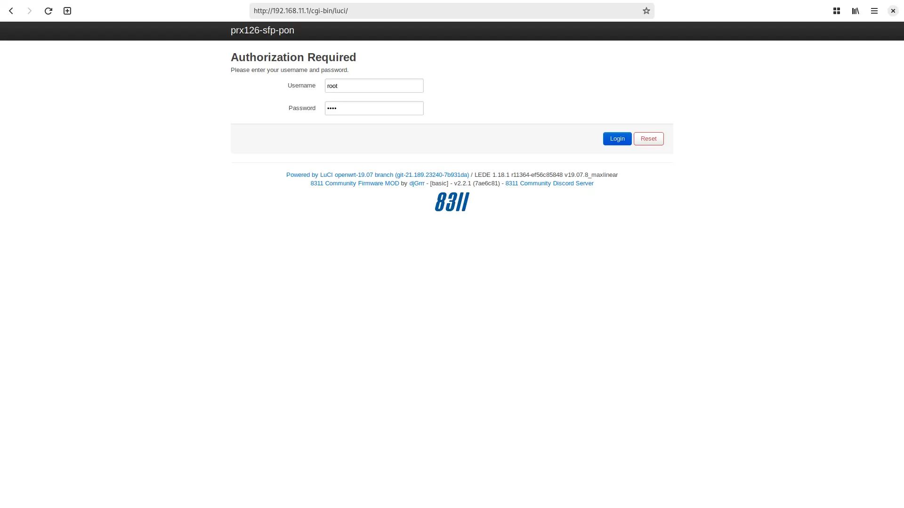

# Masquerade as the Telus Communications Inc. NH20A or NH20T on XGS-PON with the BFW Solutions WAS-110

<!-- more -->
<!-- nocont -->

## Purchase a WAS-110

The [WAS-110] is available from select distributors and at a discounted rate with group buys on the
[8311 Discord community server](https://discord.com/servers/8311-886329492438671420).

## Install community firmware

As a prerequisite to masquerading with the WAS-110, the community firmware is necessary; follow the steps
outlined in the community firmware installation guide:

[Install 8311 community firmware on the BFW Solutions WAS-110](install-8311-community-firmware-on-the-bfw-solutions-was-110.md)

## WAS-110 masquerade setup

To successfully masquerade on XGS-PON, the original ONT serial number is mandatory. It, along with other key
identifiers are available on the front label of the NH20A or NH20T, color-coordinated in the following depiction:

<div id="nh20a-nh20t-label"></div>

### from the web UI <small>recommended</small> { #from-the-web-ui data-toc-label="from the web UI"}



1. Within a web browser, navigate to
   <https://192.168.11.1/cgi-bin/luci/admin/8311/config>
   and, if asked, input your <em>root</em> password.

    ??? info "As of version 2.4.0 `https://` is supported and enabled by default"
        All `http://` URLs will redirect to `https://` unless the `8311_https_redirect` environment variable is set to
        0 or false.


2. From the __8311 Configuration__ page, on the __PON__ tab, fill in the configuration with the following values:

    !!! reminder
        <ins>Replace</ins> the :blue_circle: **PON serial number** with the provisioned value on the bottom [label] of 
        the NH20A or NH20T.

    !!! info "All attributes below are <ins>mandatory</ins> to achieve O5 operation state"

    === "NH20A"

        | Attribute                  | Value                         | Remarks                 |
        | -------------------------- | ----------------------------- | ----------------------- |
        | PON Serial Number (ONT ID) | ARCB11228311                  | :blue_circle:           |
        | Equipment ID               | NH20A                         |                         |
        | Hardware Version           | PRV650AB-S-TS                 |                         |
        | Sync Circuit Pack Version  | :check_mark:                  |                         |
        | Software Version A         | 3FEARCB1001505                | [Version listing]       |
        | Software Version B         | 3FEARCB1001505                | [Version listing]       |
        | MIB File                   | /etc/mibs/prx300_1U_telus.ini | PPTP                    |

    === "NH20T"

        | Attribute                  | Value                         | Remarks                 |
        | -------------------------- | ----------------------------- | ----------------------- |
        | PON Serial Number (ONT ID) | TMBB11228311                  | :blue_circle:           |
        | Equipment ID               | NH20A                         |                         |
        | Hardware Version           | GCNT-K                        |                         |
        | Sync Circuit Pack Version  | :check_mark:                  |                         |
        | Software Version A         | 3FEARCB1001505                | [Version listing]       |
        | Software Version B         | 3FEARCB1001505                | [Version listing]       |
        | MIB File                   | /etc/mibs/prx300_1U_telus.ini | PPTP                    |

3. __Save__ changes and reboot from the __System__ menu.

Once rebooted, the SC/APC cable can safely be plugged into the WAS-110 and immediately receive O5 operational status.

For troubleshooting, please read:

[Troubleshoot connectivity issues with the BFW Solutions WAS-110]

### from the shell

<h4>Login over SSH</h4>

```sh
ssh root@192.168.11.1
```

<h4>Configure 8311 U-Boot environment</h4>

!!! reminder
    <ins>Replace</ins> the :blue_circle: __PON serial number__ with the provisioned value on the bottom [label] of the 
    NH20A or NH20T.

!!! info "All attributes below are <ins>mandatory</ins> to achieve O5 operation state"

=== "NH20A"

    ``` sh
    fwenv_set mib_file
    fwenv_set 8311_gpon_sn ARCB11228311
    fwenv_set 8311_equipment_id NH20A
    fwenv_set 8311_hw_ver PRV650AB-S-TS
    fwenv_set 8311_cp_hw_ver_sync 1
    fwenv_set 8311_sw_verA 3FEARCB1001505 # (1)!
    fwenv_set 8311_sw_verB 3FEARCB1001505
    fwenv_set 8311_mib_file /etc/mibs/prx300_1U_telus.ini
    ```

    1. [Version listing]

=== "NH20T"

    ``` sh
    fwenv_set mib_file
    fwenv_set 8311_gpon_sn TMBB11228311
    fwenv_set 8311_equipment_id NH20T
    fwenv_set 8311_hw_ver GCNT-K
    fwenv_set 8311_cp_hw_ver_sync 1
    fwenv_set 8311_sw_verA 3FEARCB1001505 # (1)!
    fwenv_set 8311_sw_verB 3FEARCB1001505
    fwenv_set 8311_mib_file /etc/mibs/prx300_1U_telus.ini
    ```

    1. [Version listing]

!!! info "Additional details and variables are described at the original repository [^1]"
    `/usr/sbin/fwenv_set` is a helper script that executes `/usr/sbin/fw_setenv` twice consecutively.

    The WAS-110 functions as an A/B system, requiring the U-Boot environment variables to be set twice, once for each
    environment.

<h4>Verify and reboot</h4>

Prior to rebooting, verify that the 8311 environment variables are set correctly. If not, proceed to correct them with
the `fwenv_set` command as before.

```sh
fw_printenv | grep ^8311
reboot
```

Once rebooted, the SC/APC cable can safely be plugged into the WAS-110 and immediately receive O5 operational status.

For troubleshooting, please read:

[Troubleshoot connectivity issues with the BFW Solutions WAS-110]

## Software versions

The software version is used as a provisioning attribute by the OLT and must be kept up-to-date with the latest
version. Otherwise, upon a reboot, the WAS-110 will operate in a fake O5 state until corrected.

| Software Version |
| ---------------- |
| 3FEARCB1001505   |
| 3FEARCB1001307   |

Please help us by contributing new versions via the
[8311 Discord community server](https://discord.com/servers/8311-886329492438671420)
or submitting a
[Pull Request](https://github.com/up-n-atom/8311/pulls) on GitHub.

  [WAS-110]: ../xgs-pon/ont/bfw-solutions/was-110.md#value-added-resellers
  [label]: #nh20a-nh20t-label
  [Version listing]: #software-versions
  [Troubleshoot connectivity issues with the BFW Solutions WAS-110]: troubleshoot-connectivity-issues-with-the-bfw-solutions-was-110.md

[^1]: <https://github.com/djGrrr/8311-was-110-firmware-builder>
