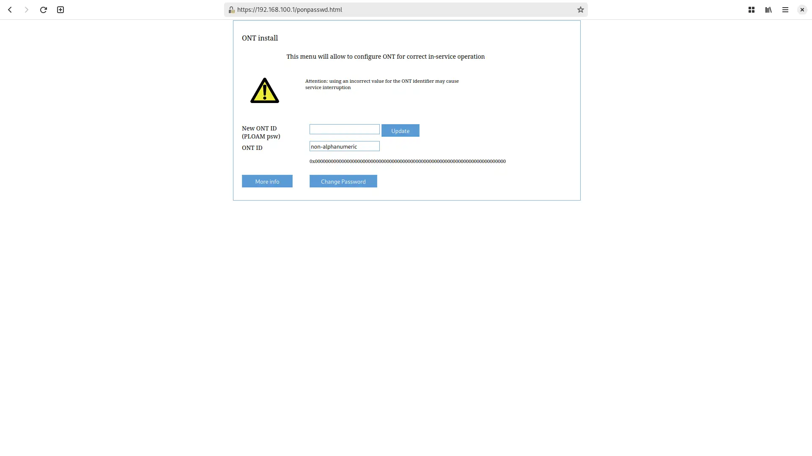
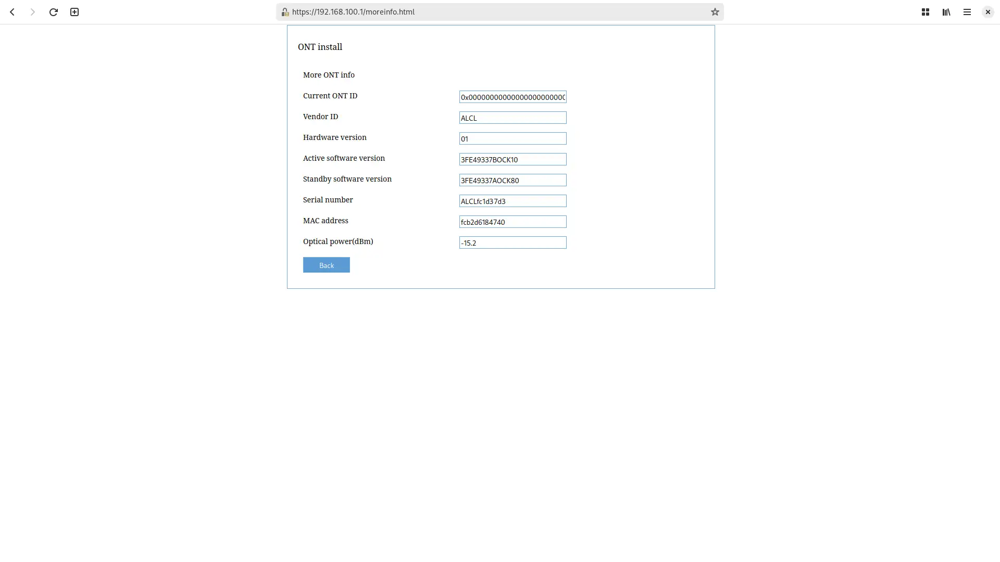

# Swap out the Nokia XS-010X-Q for a Small Form-factor Pluggable BFW Solutions WAS-110

<!-- more -->
<!-- nocont -->

## Purchase a WAS-110

The [WAS-110] is available from select distributors and at a discounted rate with group buys on the
[8311 Discord community server](https://discord.com/servers/8311-886329492438671420).

## Install community firmware

As a prerequisite to masquerading with the WAS-110, the community firmware is necessary; follow the steps
outlined in the community firmware installation guide:

[Install 8311 community firmware on the BFW Solutions WAS-110](install-8311-community-firmware-on-the-bfw-solutions-was-110.md)

## Extract attributes from the XS-010X-Q



1. Within a web browser, navigate to <https://192.168.100.1> and, if asked, input the *admin* password `1234`.

2. From the __ONT install__ page, click on __More info__ button.



3. Copy all the attributes for entry later in the guide.

## WAS-110 masquerade setup

To successfully masquerade on XGS-PON, the original ONT serial number is mandatory.

### from the web UI <small>recommended</small> { #from-the-web-ui data-toc-label="from the web UI"}


1. Within a web browser, navigate to
   <https://192.168.11.1/cgi-bin/luci/admin/8311/config>
   and, if asked, input your <em>root</em> password.

    ??? info "As of version 2.4.0 `https://` is supported and enabled by default"
        All `http://` URLs will redirect to `https://` unless the `8311_https_redirect` environment variable is set to
        0 or false.


2. From the __8311 Configuration__ page, on the __PON__ tab, fill in the configuration with the following values:

    !!! reminder "All attributes below are <ins>mandatory</ins> to achieve O5 operation state"
        <ins>Replace</ins> the __serial number__, __MAC address__, __registration ID__, and __software versions__ with
        the provisioned values.

    | Attribute                  | Value                         | Remarks                                    |
    | -------------------------- | ----------------------------- | ------------------------------------------ |
    | PON Serial Number (ONT ID) | ALCLFC1D37D3                  |                                            |
    | Equipment ID               | BVMGY10BRAXS010XQ             | CLEI + Mnemonic                            |
    | Hardware Version           | 3FE49331AAAB01                | ONT Product No. + ICS                      |
    | Sync Circuit Pack Version  | :check_mark:                  |                                            |
    | Software Version A         | 3FE49337AOCK10                |                                            |
    | Software Version B         | 3FE49337AOCK80                |                                            |
    | Firmware Version Match     | ^(3FE4933\d[A-Z]OCK\d{2})$    |                                            |
    | Registration ID            |                               | Input if __ONT ID__ is not null (all 00's) |
    | MIB File                   | /etc/mibs/prx300_1U.ini       | PPTP i.e. default value                    |
    | PON Slot                   | 10                            |                                            |
    | IP Host MAC Address        | FC:B2:D6:18:47:40             |                                            |

3. __Save__ changes and reboot from the __System__ menu.

Once rebooted, the SC/APC cable can safely be plugged into the WAS-110 and immediately receive O5 operational status.

For troubleshooting, please read:

[Troubleshoot connectivity issues with the BFW Solutions WAS-110]

### from the shell

<h4>Login over SSH</h4>

```sh
ssh root@192.168.11.1
```

<h4>Configure 8311 U-Boot environment</h4>

!!! reminder "All attributes below are <ins>mandatory</ins> to achieve O5 operation state"
    <ins>Replace</ins> the __serial number__, __MAC address__, __registration ID__, and __software versions__ with
    the provisioned values.

``` sh
fwenv_set 8311_iphost_mac FC:B2:D6:18:47:40
fwenv_set 8311_gpon_sn ALCLFC1D37D3
fwenv_set 8311_equipment_id BVMGY10BRAXS010XQ
fwenv_set 8311_hw_ver 3FE49331AAAB01
fwenv_set 8311_cp_hw_ver_sync 1
fwenv_set 8311_sw_verA 3FE49337AOCK10
fwenv_set 8311_sw_verB 3FE49337AOCK80
fwenv_set 8311_fw_match_b64 'XigzRkU0OTMzXGRbQS1aXU9DS1xkezJ9KSQ=' # (1)!
fwenv_set 8311_pon_slot 10
```

1. `echo -n '^(3FE4933\d[A-Z]OCK\d{2})$' | base64` 

!!! info "Additional details and variables are described at the original repository [^1]"
    `/usr/sbin/fwenv_set` is a helper script that executes `/usr/sbin/fw_setenv` twice consecutively.

    The WAS-110 functions as an A/B system, requiring the U-Boot environment variables to be set twice, once for each
    environment.

<h4>Verify and reboot</h4>

Prior to rebooting, verify that the 8311 environment variables are set correctly. If not, proceed to correct them with
the `fwenv_set` command as before.

```sh
fw_printenv | grep ^8311
reboot
```

Once rebooted, the SC/APC cable can safely be plugged into the WAS-110 and immediately receive O5 operational status.

For troubleshooting, please read:

[Troubleshoot connectivity issues with the BFW Solutions WAS-110]

  [WAS-110]: ../xgs-pon/ont/bfw-solutions/was-110.md#value-added-resellers
  [Troubleshoot connectivity issues with the BFW Solutions WAS-110]: troubleshoot-connectivity-issues-with-the-bfw-solutions-was-110.md

[^1]: <https://github.com/djGrrr/8311-was-110-firmware-builder>
